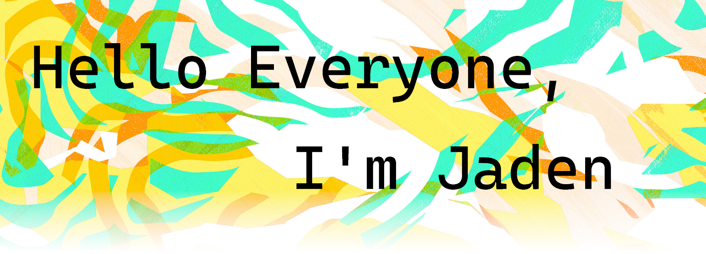

### Jaden McElvey | GT Class 2023 :mortar_board: | Atlanta, GA
I'm a student at the [Georgia Institute of Technology](https://www.gatech.edu/). I study computer science with a focus on when computing models intelligence and when computing meets users. My interests range from data science to user interface design. Currently I'm looking for my next internship for Summer 2021. Here are some of the technologies I've used over the years.

- 🌱 I’m currently learning about machine learning and low level programming!
- 💬 Ask me about being your next intern
- 📫 Email me at jadenmcelvey@gmail.com
- 📝 [Resume available here]()
- 🤖 Formerly FIRST robotics competitor
- 🐝 Go Jackets!

---

